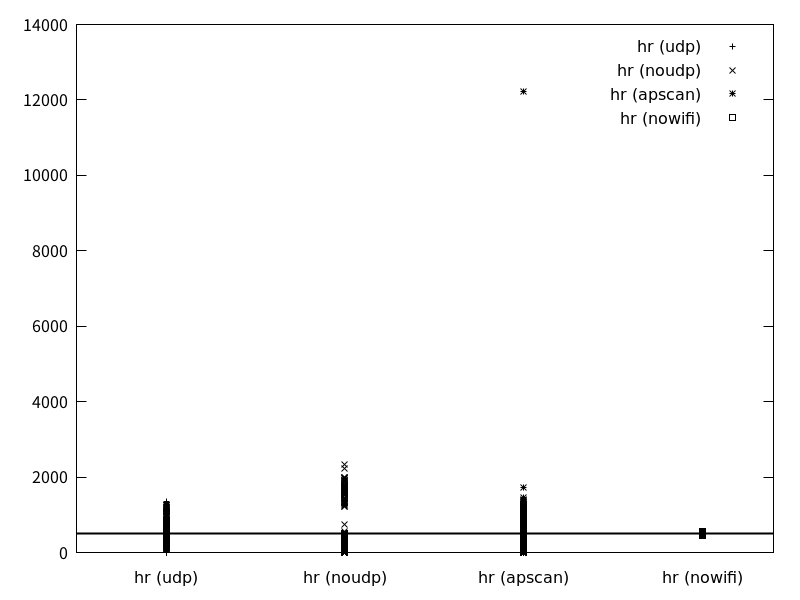
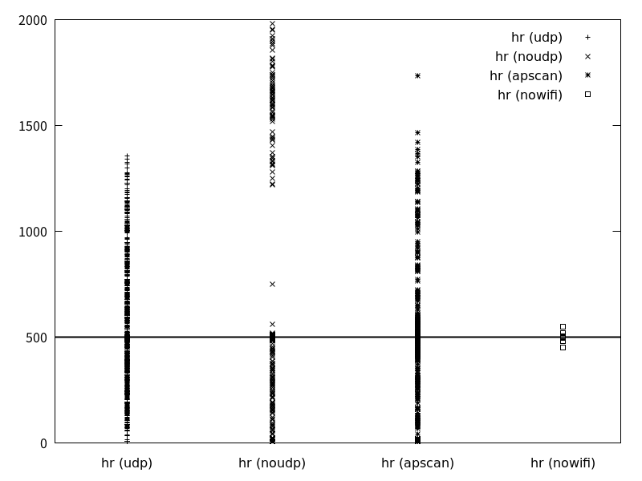

---
figureTitle:  "図"
tableTitle:   "表"
listingTitle: "リスト"
figPrefix:    "図"
tblPrefix:    "表"
lstPrefix:    "リスト"
...

# ESP32のタイマーを使いこなす

ESP32の開発環境 ESP-IDF 、および ESP-IDF の上に構築されている Arduino core for the ESP32 では、正確な時間間隔で処理を行うための仕組みがいくつか用意されています。
ただし、ESP32の無線通信処理に関連して、これらの機能を利用して正確な時間間隔で処理を行うためには、いくつか注意点があります。

## 環境

* ESP-IDF v3.3
* M5StickC (ESP32-PICO)

## 測定の準備：タイムスタンプの取得方法の確認

### タイムスタンプ取得関数 esp_timer_get_time 

ESP-IDFには、タイムスタンプを取得するAPIとして、 `esp_timer_get_time` が用意されています。esp_timer_get_time はESP32が起動してからの経過時間をマイクロ秒単位で返します。
マイクロ秒単位のタイムスタンプを返すという仕様だけを見れば、測定に十分使えるように見えます。
しかし、処理時間を測る場合、

* `esp_timer_get_time` を呼び出してから実際のタイムスタンプの取得までどれくらいの時間がかかるか
* `esp_time_get_time` の処理にかかる時間はどれくらいか

の2点について、それぞれ十分に短い時間である必要があります。

そこで、まずは esp_timer_get_time がどのように実装されているのかを確認します。

### esp_timer_get_time の実装

esp_timer_get_time は ESP-IDFの `components/esp32/esp_timer.c` で定義されています。内部では単に `esp_timer_impl_get_time` を呼び出しています。

```{#lst:esp_timer_get_time .c .numberLines caption="esp_timer_get_time"}
int64_t IRAM_ATTR esp_timer_get_time()
{
    return (int64_t) esp_timer_impl_get_time();
}
```

esp_timer_impl_get_time は ESP-IDFの `components/esp32/esp_timer_esp32.c` で定義されています。
内部では一定間隔でカウントしつづけるフリーランニング･カウンタのカウンタ値やフラグを読み取っています。

このフリーランニング･カウンタは、ESP32のペリフェラル･バス (APB) のクロックである 80[MHz] でカウントしつづけているので、分解能は 1/80[us] です。

esp_timer_impl_get_time内で呼び出されている `timer_overflow_happeded` 関数は、フリーランニング･カウンタのレジスタをいくつか呼んだ上で条件を満たすかどうかを返しています。

ESP32で使われているCPUコアである Xtensa LX6 の詳細な資料は入手出来ないため、CPUの命令ごとのサイクル数は正確には分かりませんが、少なくとも1命令あたり1CPUサイクルかかると仮定します。
timer_overflow_happened および esp_timer_impl_get_time 関数はそれぞれ 40命令 と 29命令の機械語にコンパイルされることを確認しています。

また esp_timer_impl_get_time 内の処理は、一度カウンタ値を読み出した後再度読み出したときに値が異なる場合に、最大2回実行されます。
ループが2回回った場合、タイムスタンプの元となるカウンタの値を取得するのは、ループ1回分の処理が終わった後となりますので、その分タイムスタンプの時間がずれます。
ループ1回分の命令は多く見積もっても timer_overflow_happened と esp_timer_impl_get_time 関数の命令数を越えないため、 多くとも 40+29 命令です。

実際には1サイクルで実行できる命令ばかりではありませんが、仮に平均2サイクルかかるとしたとしても、 (40+29) * 2 = 138サイクルとなります。
160[MHz]で実行している場合、138/160 [us] = 0.8625[us] ですので、タイムスタンプの時刻はばらついたとしても 1[us]弱のずれとなります。

以上より、160[MHz]動作の場合、esp_timer_get_time 関数で取得できるタイムスタンプは、1[us]の精度があると考えて良いことがわかりました。

```{#lst:esp_timer_impl_get_time .c .numberLines caption="esp_timer_impl_get_time"}
uint64_t IRAM_ATTR esp_timer_impl_get_time()
{
    uint32_t timer_val;
    uint64_t time_base;
    uint32_t ticks_per_us;
    bool overflow;

    do {
        /* Read all values needed to calculate current time */
        timer_val = REG_READ(FRC_TIMER_COUNT_REG(1));
        time_base = s_time_base_us;
        overflow = timer_overflow_happened();
        ticks_per_us = s_timer_ticks_per_us;

        /* Read them again and compare */
        /* In this function, do not call timer_count_reload() when overflow is true.
         * Because there's remain count enough to allow FRC_TIMER_COUNT_REG grow
         */
        if (REG_READ(FRC_TIMER_COUNT_REG(1)) > timer_val &&
                time_base == *((volatile uint64_t*) &s_time_base_us) &&
                ticks_per_us == *((volatile uint32_t*) &s_timer_ticks_per_us) &&
                overflow == timer_overflow_happened()) {
            break;
        }

        /* If any value has changed (other than the counter increasing), read again */
    } while(true);

    uint64_t result = time_base
                        + timer_val / ticks_per_us;
    return result;
}
// Check if timer overflow has happened (but was not handled by ISR yet)
static inline bool IRAM_ATTR timer_overflow_happened()
{
    if (s_overflow_happened) {
        return true;
    }

    return ((REG_READ(FRC_TIMER_CTRL_REG(1)) & FRC_TIMER_INT_STATUS) != 0 &&
              ((REG_READ(FRC_TIMER_ALARM_REG(1)) == ALARM_OVERFLOW_VAL && TIMER_IS_AFTER_OVERFLOW(REG_READ(FRC_TIMER_COUNT_REG(1))) && !s_mask_overflow) || 
               (!TIMER_IS_AFTER_OVERFLOW(REG_READ(FRC_TIMER_ALARM_REG(1))) && TIMER_IS_AFTER_OVERFLOW(REG_READ(FRC_TIMER_COUNT_REG(1))))));
}
```

## 一定周期で処理を実行する方法

ESP-IDF および Arduino core for the ESP32 上で 一定周期で処理を実行する方法として、以下の3つ方法があります。

1. vTaskDelayやdelayで次の周期の開始時刻まで待つ
2. FreeRTOSのソフトウェア･タイマ機能を使う
3. ESP-IDFの 高分解能タイマ機能を使う
4. ESP32のハードウェア・タイマの割り込みを使う

それぞれの方法について、次項以降で説明します。

### 方法1: vTaskDelayで次の周期の開始時刻まで待つ

一番単純な方法は、FreeRTOSのAPIである `vTaskDelay` 関数を使って、次の周期の開始時刻まで待つことです。

ただし、この方法では FreeRTOSのTickの分解能より細かい周期で処理を行うことができません。

ESP-IDFのデフォルトでは、FreeRTOSのTickの周期は10[ms]に設定されています。よって、10[ms]よりも低い分解能で十分な場合はこの方法を使うことができます。

### 方法2: FreeRTOSのソフトウェア･タイマ機能を使う

FreeRTOSは指定した時刻や一定周期で処理を実行するソフトウェア・タイマ機能があります。
機能としては、方法1と同様の処理をFreeRTOS側で自動的に行ってくれることに相当する機能となります。

よって、方法1と同様に、FreeRTOSのTickより細かい周期での処理を行うことはできません。

### 方法3: ESP-IDFの 高分解能タイマ機能を使う

ESP-IDFにはFreeRTOSのTickよりも細かい周期で処理を行うための機能として、高分解能タイマ (High Resolution Timer) が用意されています。

高分解能タイマの仕様やAPIについては、ESP-IDFのドキュメントに記載されています。
https://docs.espressif.com/projects/esp-idf/en/stable/api-reference/system/esp_timer.html

高分解能タイマ機能は `esp_timer_` で始まるAPIとして提供されています。仕様としては最小50[us]間隔で処理を実行することが出来ます。
ただし、50[us]の周期で処理を実行する場合、高分解能タイマを管理するための処理によるオーバーヘッドで多くの処理時間を使うため、あまり実用的ではありません。
100[us]周期程度が限界と考えておくのがよいでしょう。

### 方法4: ESP32のハードウェア・タイマ割り込みを使う

ESP32にはいくつかのハードウェア･タイマがあります。そのうち、ESP-IDF上でアプリケーションが自由に使えるハードウェア･タイマが合計4つあります。
ハードウェア･タイマは2つずつ、計2グループに分けられます。

ハードウェア・タイマの機能は `timer_` で始まるAPiで制御します。
詳細はESP-IDFのドキュメントに記載されています。 https://docs.espressif.com/projects/esp-idf/en/stable/api-reference/peripherals/timer.html?highlight=Timer

ハードウェア･タイマは高分解能タイマと異なり、直接割り込み処理を扱う必要がありますので、高分解能タイマよりも扱いにくい半面、細かな設定を行えます。

## 手法ごとの周期処理性能の確認

### 無線通信プログラム

実験用に、無線LANのアクセス・ポイントとして機能し、無線LANのクライアントに一定レートでデータを送信し続ける ESP32用 プログラムを作成します。
ESP-IDFに付属しているサンプル `examples/wifi/getting_started/softAP` をもとに必要な機能を追加します。

@lst:softAP_modification に実験用の無線LANアクセス・ポイント用プログラムを示します。

処理の内容は大きく分けて以下の2つです。

* M5StickCのボタンAの入力を監視し、ボタンAが押されるたびに UDP送信処理の有効・無効を切り替える
* クライアントがアクセス・ポイントに接続している、かつUDP送信処理が有効な場合、およそ512[kiB/s]になるようにクライアントにUDPでデータを送信する。

```{#lst:softAP_modification .c .numberLines caption="softAPプログラムの変更箇所"}
static esp_err_t event_handler(void *ctx, system_event_t *event)
{
	switch(event->event_id) {
	// (省略)
	case SYSTEM_EVENT_AP_STAIPASSIGNED: // クライアントにIPアドレスを割り当てた
		ESP_LOGI(TAG, "station:"IPSTR" assigned", IP2STR(&event->event_info.ap_staipassigned.ip));
		// UDP送信先として接続したクライアントのIPアドレスを保存
		client_address = event->event_info.ap_staipassigned.ip;
		// クライアント接続フラグをセット
		is_client_connected = true;
		break;
	default:
		break;
	}
	return ESP_OK;
}
// (省略)
void app_main()
{
	//Initialize NVS
	esp_err_t ret = nvs_flash_init();
	if (ret == ESP_ERR_NVS_NO_FREE_PAGES || ret == ESP_ERR_NVS_NEW_VERSION_FOUND) {
	  ESP_ERROR_CHECK(nvs_flash_erase());
	  ret = nvs_flash_init();
	}
	ESP_ERROR_CHECK(ret);
	
	ESP_LOGI(TAG, "ESP_WIFI_MODE_AP");
	wifi_init_softap();

	// M5StickCの本体のボタンA(GPIO37)入力用にGPIOを初期化
	gpio_config_t config_gpio_button;
	config_gpio_button.pin_bit_mask = (1ull<<37);
	config_gpio_button.mode = GPIO_MODE_INPUT;
	config_gpio_button.pull_up_en = GPIO_PULLUP_ENABLE;
	config_gpio_button.pull_down_en = GPIO_PULLDOWN_DISABLE;
	config_gpio_button.intr_type = GPIO_INTR_DISABLE;
	ESP_ERROR_CHECK(gpio_config(&config_gpio_button));

	// UDP送信の準備
	const uint16_t buffer_size = 10240;
	udp_init();
	struct udp_pcb* pcb = udp_new();  // lwIPのUDP処理コンテキストを作成
	// 送信データのバッファを作成
	struct pbuf* buf = pbuf_alloc(PBUF_TRANSPORT, buffer_size, PBUF_RAM);
	// 送信バッファを0〜255のデータで埋める
	for(uint16_t i = 0; i < buffer_size; i++) {
		pbuf_put_at(buf, i, i);
	}

	// 最終送信時刻を初期化する
	uint64_t start_time = esp_timer_get_time();
	// 送信データ量を初期化する
	size_t total_bytes_sent = 0;

	bool transfer_enabled = true;
	bool last_button_pressed = false;

	while(true) {
		// ボタンの状態を読み取る
		bool is_button_pressed = gpio_get_level(GPIO_NUM_37) == 0;
		if( !last_button_pressed && is_button_pressed ) {
			// ボタンが押されたらUDP送信の有効・無効を切り替える
			transfer_enabled = !transfer_enabled;
			ESP_LOGI("MAIN", "transfer: %s", transfer_enabled ? "enabled" : "disabled");
		}
		last_button_pressed = is_button_pressed;

		if( is_client_connected ) { // クライアントが接続している？
			if( transfer_enabled ) {  // UDP送信が有効？
				ip_addr_t address;
				address.type = IPADDR_TYPE_V4;
				address.u_addr.ip4 = client_address;

        // 送信バッファのデータ (10240バイト) を送信
				err_t err = udp_sendto(pcb, buf, &address, 10000);  
				
				if( err == 0 ) {
          // 送信成功したなら送信バイト数を加算
					total_bytes_sent += buffer_size;
				}
			}
			uint64_t timestamp = esp_timer_get_time();
			uint64_t elapsed_us = timestamp - start_time;
			if( elapsed_us >= 1000000ul ) {
				ESP_LOGI("MAIN", "transfer rate: %0.2lf", (total_bytes_sent*1000000.0)/elapsed_us);
				start_time = timestamp;
				total_bytes_sent = 0;
			}
		}
    // 20[ms] 待つ
		vTaskDelay(pdMS_TO_TICKS(20));
	}
}
```

### 実験の手順

前述のアクセス・ポイント用プログラムを書き込んだ M5StickC と、この後説明するタイマ性能測定用プログラムを書き込んだ M5StickC を使って、以下の手順で測定を行います。

1. アクセス・ポイント用 M5StickC の電源を入れ、アクセス・ポイントとして動作する状態にします。
2. タイマ性能測定用 M5StickC の電源を入れます。測定結果が数回出力された安定したところの結果を `UDP通信あり` での測定結果として記録します。
3. アクセス・ポイント用 M5StickC のボタンAを押し、UDP送信を停止します。
4. 測定結果が数回出力された安定したところの結果を `UDP通信なし` での測定結果として記録します。
5. アクセス・ポイント用 M5StickC の電源を切ります。
6. タイマ性能測定用 M5StickC のログ出力で `retrying AP connection` と表示されている間の測定結果を記録し、 `アクセス・ポイント検索中` の測定結果として記録します。
7. `retrying AP connection` が5回接続され、アクセス・ポイントの検索処理が停止してしばらくしたところの測定結果を記録し、 `無線接続なし` の測定結果として記録します。

## 実験その1: 高分解能タイマの性能

### 実験プログラム概要

ESP-IDFの高分解能タイマの処理の周期の正確さがどれくらいなのか調べるため、ESP-IDF付属の無線LAN接続サンプル・コードを変更した実験用プログラムを作成しました。
元にしたサンプル・コードは ESP-IDFの `examples/wifi/getting_started/station` 以下にあるプログラムです。

サンプル・コードに対して追加した機能は次の通りです。

1. 高分解能タイマを初期化し、500[us]間隔で処理を実行するように設定します。
2. 無線通信を有効にして測定する場合は、無線LANを初期化し、アクセスポイントに接続します。
3. 周期処理ルーチンから後述の通知があるまで待機します。
4. タイマの周期処理の中で、`esp_timer_get_time` 関数を使ってタイムスタンプを取得し、前回周期処理を実行してからの経過時間を計算します。計算した経過時間を配列に保存しておきます。
5. 16384回、周期処理を終えたら、(3))で通知を待機しているメインタスクに通知します。
6. (4)で計測した結果をシリアル通信経由でターミナルに出力します。

このプログラムを `a. 無線LAN通信なし`, `b. 無線LAN通信あり(アクセスポイントに接続のみ)` および `c. 無線LAN通信あり(500[kiB/s]くらいのレートでUDPパケット受信)` の2つの設定で実行して、(3)で測定した周期処理の間隔がどのように変化するかを測定しました。


```
```

### 測定結果

@fig:hrtimer_result に測定結果を示します。

測定結果の種類とグラフ上の名称の対応は @tbl:result_item_name のとおりです。

| 種類  |  グラフ上の名称 |
|---|---|
| UDP通信あり | udp |
| UDP通信なし | noudp |
| アクセス・ポイント検索中 | apscan |
| 無線接続なし | nowifi |
:{tbl:result_item_name}(測定結果の種類とグラフ上の名称)

グラフの縦軸は、それぞれの測定結果ごとの周期処理の間隔を[us]単位で表しています。

また、0〜2000 [us] の範囲を切り出したグラフを @fig:hrtimer_result_wo_outlier に示します。

{@fig:hrtimer_result}

{@fig:hrtimer_result_wo_outlier}

### 結果：高分解能タイマは使い物にならない

測定結果の `nowifi` より、無線通信無効時はそれなりの正確さで周期処理を実行できています。
一方、無線通信有効時は周期処理の間隔がかなり大きくずれています。特にアクセス・ポイント検索処理中には`12,000[us]` の間が開く場合がありました。これでは高分解能タイマを使う意味がありません。

なぜこのような結果になるのか、ESP-IDFの高分解能タイマの実装から読み解いてみます。

### 高分解能タイマの実装

ESP-IDFの高分解能タイマは、32bit ハードウェア・タイマとソフトウェアの64ビットカウンタを組み合わせて、1[us]分解能の64bitタイマを実装しています。

高分解能タイマ・モジュールは、処理を行う時刻が早い順のリストを持っています。ある時刻に処理を実行するタイマを追加すると、処理を実行するために必要な情報がリストに登録されます。
また、追加した処理の実行予定時刻がリストの中で最も早い場合、その時刻にハードウェア・タイマの割り込みが発生するように設定します。

割り込みハンドラから呼び出される関数では、 `esp_timer_create_args_t` の `dispatch_method` フィールドに指定した値に応じた方法で、`callback`フィールドに指定したコールバック関数を呼び出します。

dispatch_method に指定できる値は  列挙体 で定義されていますが、現在のところ `ESP_TIMER_TASK` しか定義されていません。
ESP_TIMER_TASK を指定した場合は、割り込みハンドラ内でコールバック関数を直接実行するのではなく、専用のタスクで実行します。

割り込みハンドラ内ではコールバック関数実行用のタスクに対して通知を行い、現在のタスクの実行を中断してタスクの再スケジュールを行います。

コールバック関数実行用のタスクは、PRO_CPUで優先度 `configMAX_PRIORITIES -3` のタスクとなっています。
一方、ESP-IDFで無線通信を行うタスクは、PRO_CPUで優先度 `configMAX_PRIORITIES - 2`で実行されています。
無線通信処理の方が優先度が高いため、無線通信処理が実行されている間は、高分解能タイマのコールバック関数呼び出しは実行されません。
このため、無線通信機能が有効な場合、高分解能タイマのコールバック関数を呼び出しタイミングが大きくずれる場合があります。

対策としては、

* コールバック関数実行用タスクの優先度を無線通信処理より高くする
* コールバック関数実行用タスクをAPP_CPUで実行する
* 割り込みハンドラで直接コールバック関数を実行する

といった方法が考えられます。

ただし、現時点のESP-IDF v3.3では、コールバック関数実行用タスクの優先度を変更する機能や、コールバック関数を割り込み関数から直接実行する機能は実装されていません。
よって、現時点では無線通信を使う場合、高精度な周期処理を実装するためには、高分解能タイマは使えないということになります。

## 実験２：ハードウェア・タイマを使った周期処理の実装

### 実験の内容

前述の実験で、無線通信機能が有効な場合、現状のESP-IDFの高分解能タイマはあまり使い物にならないということがわかりました。
そこで、代わりにハードウェア・タイマを直接使って周期処理を実装します。

また、前述の通り、高分解能タイマでは、タイマ処理用タスクの優先度や実行するCPUが適切でないことが問題の原因となっていました
一方、ハードウェア・タイマでも、同様に割り鋳込み内で行うには時間のかかる処理を専用のタスクで実行します。
このタスクの優先度や実行するCPUをどのように設定したらよいのかを確認するため、 @tbl:hwtimer_params の範囲で優先度とCPUを変更して測定を行いました。

| パラメータ名 |  マクロ名 | 値 | 
|---|---|---|
| タイマ処理タスクの優先度 | CONFIG_HARDWARE_TIMER_TASK_PRIORITY | 22, 24 |
| タイマ処理タスクのCPU | CONFIG_HARDWARE_TIMER_TASK_CPU | 0, 1 |
:{タイマ処理タスクのパラメータ}(tbl:hwtimer_params)


```c
#if CONFIG_TARGET_HARDWARE_TIMER_GROUP_0
#define TIMER_GROUP TIMER_GROUP_0
#define TIMERG TIMERG0
#elif CONFIG_TARGET_HARDWARE_TIMER_GROUP_1
#define TIMER_GROUP TIMER_GROUP_1
#define TIMERG TIMERG1
#endif

#define TIMER_CLOCK_DIVIDER 400
#define TIMER_COUNTER_PERIOD ((uint64_t)100)
#endif
#if CONFIG_PLACE_CALLBACK_ON_IRAM
#define CALLBACK_PLACE_ATTR IRAM_ATTR
#else
#define CALLBACK_PLACE_ATTR
#endif

static volatile int64_t last_timer_timestamp = 0;
static volatile int64_t isr_timestamp = 0;
#define NUM_INTERVALS 16384
typedef struct {
    uint32_t interval;  // 計測した周期
    uint32_t delay;     // 割り込みからタイマ処理タスクまでの遅延
} IntervalItem;
static volatile IntervalItem intervals[NUM_INTERVALS] = {0};
static volatile uint32_t interval_index = 0;

// 割り込みハンドラ
static IRAM_ATTR void hardware_timer_isr(void* arg)
{
  if( TIMERG.int_raw.t0 == 0 ) {
    return;
  }
  // 割り込みフラグをクリア
  TIMERG.int_clr_timers.t0 = 1;
  // カウンターをクリア
  TIMERG.hw_timer[0].load_high = 0;
  TIMERG.hw_timer[0].load_low = 0;
  TIMERG.hw_timer[0].reload = 0;  // set counter to zero.

  // タイムスタンプを取得
  int64_t timestamp = esp_timer_get_time();
  // 次の割り込み時刻を設定
  TIMERG.hw_timer[0].alarm_high = (uint32_t) (TIMER_COUNTER_PERIOD >> 32);
  TIMERG.hw_timer[0].alarm_low = (uint32_t) TIMER_COUNTER_PERIOD;
  TIMERG.hw_timer[0].config.alarm_en = TIMER_ALARM_EN;
  // タイムスタンプを保存
  if( interval_index < NUM_INTERVALS && intervals[interval_index].interval == 0 ) {
    isr_timestamp = timestamp;
    intervals[interval_index].interval = timestamp - last_timer_timestamp;
  }
  last_timer_timestamp = timestamp;

  // 周期処理を行うタスクに通知
  TaskHandle_t timer_task = (TaskHandle_t)arg;
  xTaskNotifyFromISR(timer_task, 1, eSetBits, NULL);
  // スケジューラ実行
  portYIELD_FROM_ISR();
}

// タイマー処理タスクの本体
static CALLBACK_PLACE_ATTR void timer_task(void* arg)
{
  // タイマー初期化
  timer_config_t timer_config = {
    .alarm_en = true,
    .counter_en = false,
    .intr_type = TIMER_INTR_LEVEL,
    .counter_dir = TIMER_COUNT_UP,
    .auto_reload = true,
    .divider = TIMER_CLOCK_DIVIDER,
  };
  ESP_ERROR_CHECK(timer_init(TIMER_GROUP, 0, &timer_config));
  ESP_ERROR_CHECK(timer_set_counter_value(TIMER_GROUP, 0, 0));
  ESP_ERROR_CHECK(timer_set_alarm_value(TIMER_GROUP, 0, TIMER_COUNTER_PERIOD));
  ESP_ERROR_CHECK(timer_isr_register(TIMER_GROUP, 0, hardware_timer_isr, 
                  xTaskGetCurrentTaskHandle(), ESP_INTR_FLAG_IRAM, NULL));
  ESP_ERROR_CHECK(timer_start(TIMER_GROUP, 0));

  while(true) {
    uint32_t notification_value = 0;
    // 割り込みハンドラからの通知を待つ
    xTaskNotifyWait(0, 1, &notification_value, portMAX_DELAY);
    TaskHandle_t main_task = (TaskHandle_t)arg;
    int64_t timestamp = esp_timer_get_time();
    // 割り込みハンドラからの遅延時間を計算して保存
    if( interval_index < NUM_INTERVALS ) {
      if( intervals[interval_index].interval != 0 ) {
        intervals[interval_index].delay = (uint32_t)(timestamp - isr_timestamp);
        interval_index++;
      }
    }
    else {
      // NUM_INTERVALS回計測したらメイン・タスクに通知
      xTaskNotify(main_task, 1, eSetBits);
    }
  }
}

void app_main()
{
    // (省略)

    ESP_LOGI(TAG, "ESP_WIFI_MODE_STA");
    wifi_init_sta();
    initialize_udp();
    ESP_LOGI(TAG, "Waiting AP connection...");
    xEventGroupWaitBits(s_wifi_event_group, WIFI_CONNECTED_BIT, 0, 0, portMAX_DELAY);

    // タイマー処理タスクを起動
    ESP_LOGI(TAG, "Use hardware timer, priority=%d, cpu=%d", CONFIG_HARDWARE_TIMER_TASK_PRIORITY, CONFIG_HARDWARE_TIMER_TASK_CPU);
    TaskHandle_t timer_task_handle = NULL;
    xTaskCreatePinnedToCore(timer_task, "HW_TIMER", 4096, xTaskGetCurrentTaskHandle(),
      CONFIG_HARDWARE_TIMER_TASK_PRIORITY, &timer_task_handle, CONFIG_HARDWARE_TIMER_TASK_CPU); // (1)
    
    while(true) {
        uint32_t notification_value = 0;
        xTaskNotifyWait(0, 1, &notification_value, portMAX_DELAY);
        // 省略
    }
}
```

まず、 `xTaskCreatePinnedToCore` を呼び出して、`timer_task` 関数を実行するタイマ処理タスクを起動します。
この時のタスクの優先度と実行CPUは、実験のパラメータに応じて変更します。(1)

タイマ処理タスクの先頭で、 `timer_` で始まるESP-IDFのAPIを呼び出して、ハードウェア・タイマを初期化します。

### 実験の結果


### 結果から見える方針

実験結果より、タイミングがシビアな処理は、割り込みハンドラ内で処理をしてしまうのが良いことがわかります。
ただし、割り込みハンドラであまり長い処理を実行すると、他の割り込み処理に影響がでますので、必要最小限の処理のみ行うようにします。

例えば、周期的にADCから値を読み取り何かしらの処理をする場合、ADCの変換を開始するタイミングがばらつくと測定結果に影響します。
一方、ADCの変換結果を使った計算処理は、平均的にADCのサンプリングレートと同じか速いレートで処理できれば良いとします。
こういった場合、割り込みハンドラ内でADCの変換開始処理を行い、残りの計算処理を専用のタスクで実行するようにします。
このとき、計算処理はAPP_CPUで実行しているタスクで実行し、確実に必要な処理レートを下回らないようにします。

# 参考文献

* Espressif Inc, ESP32 Technical Reference Manual V2.3(http://espressif.com/sites/default/files/documentation/esp32_technical_reference_manual_en.pdf)
* Espressif Inc, ESP-IDF Programming Guide v3.1 (https://docs.espressif.com/projects/esp-idf/en/v3.1/)
* Bluetooth SIG, Specification of the Bluetooth System (https://www.bluetooth.org/DocMan/handlers/DownloadDoc.ashx?doc_id=441541&_ga=2.2788979.2127376998.1526238267-1586719393.1526238267)
* 足立 英治	IoT時代の最新Bluetooth5	インターフェース2017年11月号 pp.85-92
* 井田 健太	IoT実験に便利！500円Wi-Fiに新タイプ登場	インターフェース2017年11月号 pp.20-30
* CC2650 SensorTag User's Guide (http://processors.wiki.ti.com/index.php/CC2650_SensorTag_User%27s_Guide)
* SensorTag attribute table (http://processors.wiki.ti.com/images/a/a8/BLE_SensorTag_GATT_Server.pdf)
* インターネット経由でSORACOM Harvestにデータが入れられるようになりました。 (https://blog.soracom.jp/blog/2018/07/04/inventory-update/)
* デバイスIDとデバイスシークレットを使用してHarvestにデータを送信する (https://dev.soracom.io/jp/start/inventory_harvest_with_keys/)